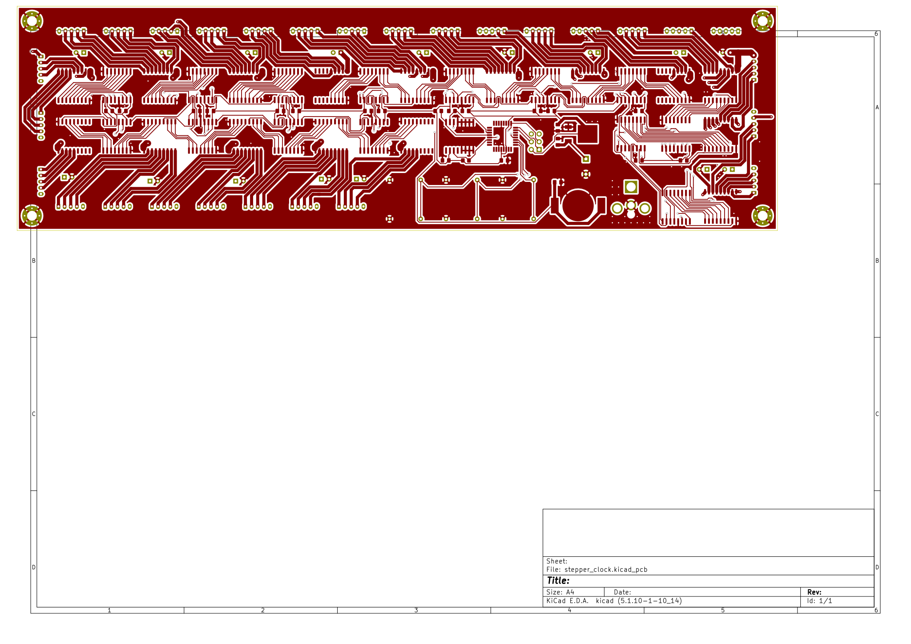
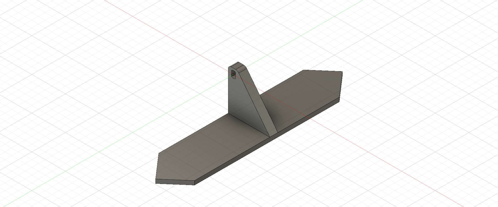

# Stepper Clock
This project is a work in progress!! The main gial for this project was to recreate this awesome looking clock https://hackaday.com/2021/08/11/a-whole-lot-of-stepper-motors-make-the-most-graceful-7-segment-displays/ and learn about PCB design along the way!

The circuit is made up of:
- 28 stepper motors (8 segments x 4 digits = 28 parts)
- a Atmega328 for the brains
- a high precision RTC to accurate count time (plus a backup battery)
- 13 74HC595 shift registers for the stepper control pattern data
- 15 ULN2803A transistor array ICs for stepper motor driving
- 3 push buttons to set the time
- a 10A 5V power supply

The hardware for the clock will be:
- 3D printed segments
- laser cut wood board to mount the clock

## images

### Schematic and PCB
3d view

front copper

back copper

front silkscreen

### 3D Printed Parts

segment

motor mount

